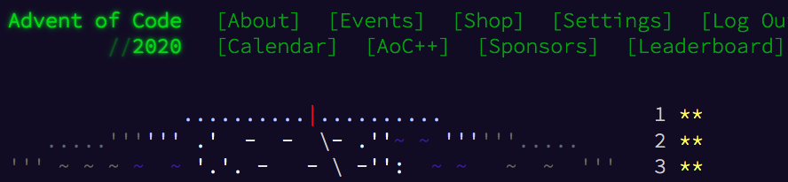

# Advent of Code 2020

<p class="banner"><sup><a href="https://adventofcode.com/2020">Go to the site</a>, <a href="https://raw.githubusercontent.com/gto76/advent-of-code-2020/master/advent_2020.py">Download Python script</a> or <a href="https://github.com/gto76/advent-of-code-2020">Fork me on GitHub</a>.</sup></p>

<p class="banner"></p>

## Entries

```text
1721
979
366
299
675
1456
```

### Find the two entries that sum to 2020; what do you get if you multiply them together?

```python
def problem_1_a(lines):
    '''514579'''
    import itertools
    numbers = [int(line) for line in lines]
    for l, r in itertools.combinations(numbers, 2):
        if l + r == 2020:
            return l * r
```

### In your expense report, what is the product of the three entries that sum to 2020?

```python
def problem_1_b(lines):
    '''241861950'''
    import itertools
    numbers = [int(line) for line in lines]
    for a, b, c in itertools.combinations(numbers, 3):
        if a + b + c == 2020:
            return a * b * c
```

## Passwords

```text
1-3 a: abcde
1-3 b: cdefg
2-9 c: ccccccccc
```

### How many passwords are valid according to their policies?

```python
def problem_2_a(lines):
    '''2'''
    import re
    def is_valid(line):
        min_, max_, letter, password = re.match('^(\d+)-(\d+) (\w): (\w+)$', line).groups()
        return int(min_) <= password.count(letter) <= int(max_)
    return sum(is_valid(line) for line in lines)
```

### How many passwords are valid according to the new interpretation of the policies?

```python
def problem_2_b(lines):
    '''1'''
    import re
    def is_valid(line):
        i_1, i_2, letter, password = re.match('^(\d+)-(\d+) (\w): (\w+)$', line).groups()
        return (password[int(i_1)-1] == letter) + (password[int(i_2)-1] == letter) == 1
    return sum(is_valid(line) for line in lines)
```

## Trees

```text
..##.......
#...#...#..
.#....#..#.
..#.#...#.#
.#...##..#.
..#.##.....
.#.#.#....#
.#........#
#.##...#...
#...##....#
.#..#...#.#
```

### Starting at the top-left corner of your map and following a slope of right 3 and down 1, how many trees would you encounter?

```python
def problem_3_a(lines):
    '''7'''
    import collections
    P = collections.namedtuple('P', 'x y')
    positions = (P(x=y*3, y=y) for y in range(len(lines)))
    is_tree = lambda p: lines[p.y][p.x % len(lines[0])] == '#'
    return sum(is_tree(p) for p in positions)
```

### What do you get if you multiply together the number of trees encountered on each of the listed slopes?

```python
def problem_3_b(lines):
    '''336'''
    import collections, functools, itertools, operator
    P = collections.namedtuple('P', 'x y')
    def get_positions(slope):
        x_generator = itertools.count(start=0, step=slope.x)
        return (P(next(x_generator), y) for y in range(0, len(lines), slope.y))
    is_tree = lambda p: lines[p.y][p.x % len(lines[0])] == '#'
    count_trees = lambda slope: sum(is_tree(p) for p in get_positions(slope))
    slopes = [P(x=1, y=1), P(x=3, y=1), P(x=5, y=1), P(x=7, y=1), P(x=1, y=2)]
    return functools.reduce(operator.mul, (count_trees(slope) for slope in slopes))
```

## Passports

```text
ecl:gry pid:860033327 eyr:2020 hcl:#fffffd
byr:1937 iyr:2017 cid:147 hgt:183cm

iyr:2013 ecl:amb cid:350 eyr:2023 pid:028048884
hcl:#cfa07d byr:1929

hcl:#ae17e1 iyr:2013
eyr:2024
ecl:brn pid:760753108 byr:1931
hgt:179cm

hcl:#cfa07d eyr:2025 pid:166559648
iyr:2011 ecl:brn hgt:59in
```

### In your batch file, how many passports are valid?

```python
def problem_4_a(lines):
    '''2'''
    passports = ' '.join(lines).split('  ')
    get_keys = lambda passport: {item.split(':')[0] for item in passport.split()}
    is_valid = lambda passport: len(get_keys(passport) - {'cid'}) == 7
    return sum(is_valid(p) for p in passports)
```

### In your batch file, how many passports are valid?

```python
def problem_4_b(lines):
    '''2'''
    import re
    RULES = dict(
        byr=lambda v: 1920 <= int(v) <= 2002,
        iyr=lambda v: 2010 <= int(v) <=  2020,
        eyr=lambda v: 2020 <= int(v) <=  2030,
        hgt=lambda v: 150 <= int(v[:-2]) <= 193 if 'cm' in v else 59 <= int(v[:-2]) <= 76,
        hcl=lambda v: re.match('#[0-9a-f]{6}$', v) != None,
        ecl=lambda v: v in 'amb blu brn gry grn hzl oth'.split(),
        pid=lambda v: re.match('\d{9}$', v) != None
    )
    def is_field_valid(key, value):
        try:
            return RULES[key](value)
        except Exception:
            return False
    def is_passport_valid(passport):
        return sum(is_field_valid(*item.split(':')) for item in passport.split()) == 7
    passports = ' '.join(lines).split('  ')
    return sum(is_passport_valid(p) for p in passports)
```

## Seat IDs

```text
BBFFBBFLLR
BBFFBBFLRL
BBFFBBFRLL
```

### What is the highest seat ID on a boarding pass?

```python
def problem_5_a(lines):
    '''820'''
    get_bin = lambda code: ''.join('0' if ch in 'FL' else '1' for ch in code)
    get_id  = lambda code: int(get_bin(code), 2)
    return max(get_id(code) for code in lines)
```

### What is the ID of your seat?

```python
def problem_5_b(lines):
    '''819'''
    get_bin   = lambda code: ''.join('0' if ch in 'FL' else '1' for ch in code)
    get_id    = lambda code: int(get_bin(code), 2)
    taken_ids = {get_id(code) for code in lines}
    all_ids   = range(min(taken_ids), max(taken_ids)+1)
    return (set(all_ids) - taken_ids).pop()
```

## Day 6

```text
abc

a
b
c

ab
ac

a
a
a
a

b
```

### For each group, count the number of questions to which anyone answered "yes". What is the sum of those counts?

```python
def problem_6_a(lines):
    '''11'''
    groups = ' '.join(lines).split('  ')
    return sum(len(set(group) - {' '}) for group in groups)


# def problem_6_a(lines):
#     '''For each group, count the number of questions to which anyone answered "yes". What is
#     the sum of those counts? 11'''
#     groups = ' '.join(lines).split('  ')
#     count_groups_answers = lambda group: len(set(group.replace(' ', '')))
#     return sum(count_groups_answers(group) for group in groups)


# def problem_6_a(lines):
#     '''For each group, count the number of questions to which anyone answered "yes". What is
#     the sum of those counts? 11'''
#     groups = ' '.join(lines).split('  ')
#     get_groups_answers = lambda group: set(group.replace(' ', ''))
#     return sum(len(get_groups_answers(group)) for group in groups)


# def problem_6_a(lines):
#     '''For each group, count the number of questions to which anyone answered "yes". What is
#     the sum of those counts? 11'''
#     groups = ' '.join(lines).split('  ')
#     get_groups_answers = lambda group: set(group) - {' '}
#     return sum(len(get_groups_answers(group)) for group in groups)
```

### For each group, count the number of questions to which everyone answered "yes". What is the sum of those counts?

```python
def problem_6_b(lines):
    '''6'''
    import functools, operator
    groups             = ' '.join(lines).split('  ')
    split_group        = lambda group: [set(a) for a in group.split(' ')]
    get_common_answers = lambda group: functools.reduce(operator.and_, split_group(group))
    return sum(len(get_common_answers(group)) for group in groups)


# def problem_6_b(lines):
#     '''For each group, count the number of questions to which everyone answered "yes". What is
#     the sum of those counts? 6'''
#     import functools, operator
#     groups         = ' '.join(lines).split('  ')
#     get_people     = lambda group: [set(a) for a in group.split(' ')]
#     common_answers = [functools.reduce(operator.and_, get_people(group)) for group in groups]
#     return sum(len(a) for a in common_answers)


# def problem_6_b(lines):
#     '''For each group, count the number of questions to which everyone answered "yes". What is
#     the sum of those counts? 6'''
#     import functools, operator
#     groups = ' '.join(lines).split('  ')
#     split_group        = lambda group: [set(a) for a in group.split(' ')]
#     get_common_answers = lambda group: functools.reduce(operator.and_, split_group(group))
#     return sum(len(get_common_answers(group)) for group in groups)


# def problem_6_b(lines):
#     '''For each group, count the number of questions to which everyone answered "yes". What is
#     the sum of those counts? 6'''
#     import functools, operator
#     groups = ' '.join(lines).split('  ')
#     split_group = lambda group: [set(a) for a in group.split(' ')]
#     get_common_answers = lambda group: functools.reduce(operator.and_, split_group(group))
#     return sum(len(get_common_answers(group)) for group in groups)
```